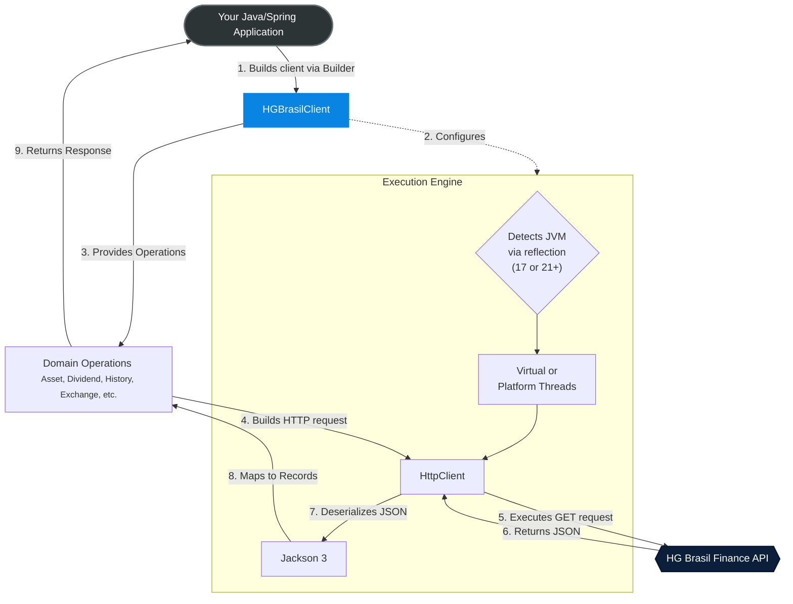

# HG Brasil Finance Client - Java SDK


[](LICENSE)
[](https://github.com/jvlealc/hgbrasil-finance-java/actions)
[](https://central.sonatype.com/artifact/io.github.jvlealc/hgbrasil-finance-client)

:us: English

The HG Brasil Finance Client is an open-source Java SDK designed to simplify integration with the HG Brasil Finance API.

The project provides a type-safe interface for consuming financial market data, eliminating the need for manual HTTP calls, extensive JSON mapping, and boilerplate error handling.

---

## Features

The client delivers structured data through modern, immutable **Records** for the following resources:

* **Capital Markets (B3):** Real-time and delayed data for Stocks, Real Estate Funds (FIIs), BDRs, Investment Funds, and market indices.
* **Dividends and Earnings:** Detailed historical distribution of dividends, Interest on Equity (JCP), and stock bonuses for B3-listed assets.
* **Splits and Reverse Splits:** Full history of stock splits and reverse splits (grupamentos) for stocks, FIIs, and BDRs.
* **Currencies and Crypto:** Exchange rates for fiat currencies in Brazilian Real (BRL) and cryptocurrency quotes in US Dollars (USD).
* **Brazilian Economic Indicators:** Key interest rates (SELIC, CDI, TR) and inflation indicators (IPCA, IGP, INCC) including historical series.
* **Historical Series:** Comprehensive historical and intraday data for B3 assets, indices, currencies, and cryptocurrencies.

---

## Quick Start

To use the client in your Maven project, add the following dependency to your `pom.xml` file:

```xml
<dependency>
    <groupId>io.github.jvlealc</groupId>
    <artifactId>hgbrasil-finance-client</artifactId>
    <version>1.0.0</version>
</dependency>
```

For projects using Gradle:

```groovy
implementation 'io.github.jvlealc:hgbrasil-finance-client:1.0.0'
```

## Usage Example

```java
import io.github.jvlealc.hgbrasil.finance.client.HGBrasilClient;
import io.github.jvlealc.hgbrasil.finance.client.AssetOperations;
import io.github.jvlealc.hgbrasil.finance.client.model.AssetResult;

public class Main {
   public static void main(String[] args) {
      try (HGBrasilClient client = HGBrasilClient.builder()
              .apiKey("YOUR_API_KEY")
              .build()) {

         AssetOperations assetOperations = client.getAssetOperations();

         // Query using utility method findFirstResult()
         AssetResult petr4 = assetOperations.getBySymbol("PETR4")
                 .findFirstResult()
                 .orElseThrow();

         System.out.println("Asset: " + petr4.name());
         System.out.println("Price: R$ " + petr4.price());
         System.out.println("Percent Change: " + petr4.changePercent() + "%");
      }
   }
}
```

**See more practical examples in the [Examples Gallery](./examples/README.md).**

## Available Operations

| Operation                     | Description                                                             |
|:------------------------------|:------------------------------------------------------------------------|
| `getAssetOperations()`        | Real-time quotes for Stocks, FIIs, BDRs, Crypto, and Indices.           |
| `getAssetHistoryOperations()` | OHLCV historical time-series data for B3 assets.                        |
| `getExchangeOperations()`     | Global fiat currencies (USD, EUR, etc.) against BRL and Bitcoin quotes. |
| `getDividendOperations()`     | Comprehensive dividend, JCP (Interest on Equity), and earnings history. |
| `getSplitOperations()`        | Corporate actions history (Splits and Reverse Splits).                  |
| `getIndicatorOperations()`    | Brazilian economic indicators (SELIC, CDI, IPCA, IGP-M, TR).            |
| `getIbovespaOperations()`     | Intraday points and historical data for the Ibovespa market index.      |

---

## Technologies

The SDK was designed with a strong focus on performance and modern Java practices.

* **HTTP Client (Native):** Uses `java.net.http.HttpClient` for network requests.
* **Jackson 3 (Core and JSR310):** High-performance engine for JSON processing and data binding.
* **JUnit 5 & Mockito:** Comprehensive unit and integration test coverage.

## Architecture

### Concurrency via Reflection (Java 17 & 21+)

One of the core strengths of this SDK is its **Adaptive Execution Engine**. The project is compiled targeting **Java 17** to ensure broad enterprise compatibility. However, at runtime, the SDK uses **Java Reflection** to dynamically detect the capabilities of your JVM:

* **Java 21+ (Virtual Threads):** If the SDK detects a modern JVM and no custom `HttpClient` or `Executor` is provided, it automatically instantiates a `VirtualThreadPerTaskExecutor`. This allows for massive concurrency and non-blocking I/O out-of-the-box, ideal for high-frequency financial data polling.
* **Java 17 (Platform Threads):** If running on an older JVM, it gracefully falls back to the native `HttpClient` default executor, ensuring full stability.

### Main Client (HGBrasilClient)

The core class that manages the lifecycle and provides access to the API operations is `HGBrasilClient.java`.
It was designed using the Builder pattern to ensure a fluent and thread-safe configuration and initialization.

To get started, the only required parameter is your `apiKey`. However, keeping in mind the architectural flexibility of different applications and aiming for an excellent *Developer Experience* (DX),
the `Builder` allows you to inject custom components, enabling you to use your own instances of `HttpClient`, `ObjectMapper`, and `ExecutorService` to seamlessly integrate the SDK into your ecosystem.

**Warning:** The SDK automatically manages date conversions and the safe mapping of predefined values (`Enums`) from the API's JSON to the model *Records*.
If you choose to inject a custom `ObjectMapper`, it is **highly recommended** to register the `JavaTimeModule` and enable the `READ_UNKNOWN_ENUM_VALUES_USING_DEFAULT_VALUE` feature in your *mapper*. This ensures that deserialization occurs without failures.

### Architecture Overview

> The client acts as a Facade for configuration and access to the operation classes, while the Operations encapsulate the construction of HTTP requests and the processing of responses through a shared HTTP execution engine.



---

## Contributing

Contributions are more than welcome! If you find a *bug*, have any suggestions for improvements or an idea for a new feature,
feel free to *Fork* the repository and open a *Pull Request*.

We strive for high code coverage. Before sending your code, please ensure that all tests are passing.

**Note: The integration tests perform calls to the real API. You will need to export your HG Brasil API key as an ENVIRONMENT VARIABLE.**

To maintain the quality and repository standards, we ask that you keep two key points in mind:

1. **Tests:** Ensure that all your changes are covered by tests and are passing on your machine.
    * Unit Tests: execute `mvn clean test`.
    * Integration Tests: export your environment variable `HGBRASIL_API_KEY` with a valid API key and run `mvn clean verify`. If the variable is not found, the integration tests will be gracefully skipped.
2. **Commit Pattern:** This project follows the [Conventional Commits](https://www.conventionalcommits.org/). Structure your commit messages using the correct prefixes (e.g., `feat:`, `fix:`, `refactor:`, `test:`).

## License

This project is *open-source* and is licensed under the *MIT License*.
See the `LICENSE` file in the repository for more details.

## Contact

Developed by João Leal

- E-mail: [jv.leal.dev@gmail.com](mailto:jv.leal.dev@gmail.com)
- LinkedIn: [linkedin.com/in/joaovlc](https://linkedin.com/in/joaovlc)
- GitHub: [github.com/jvlealc](https://github.com/jvlealc)